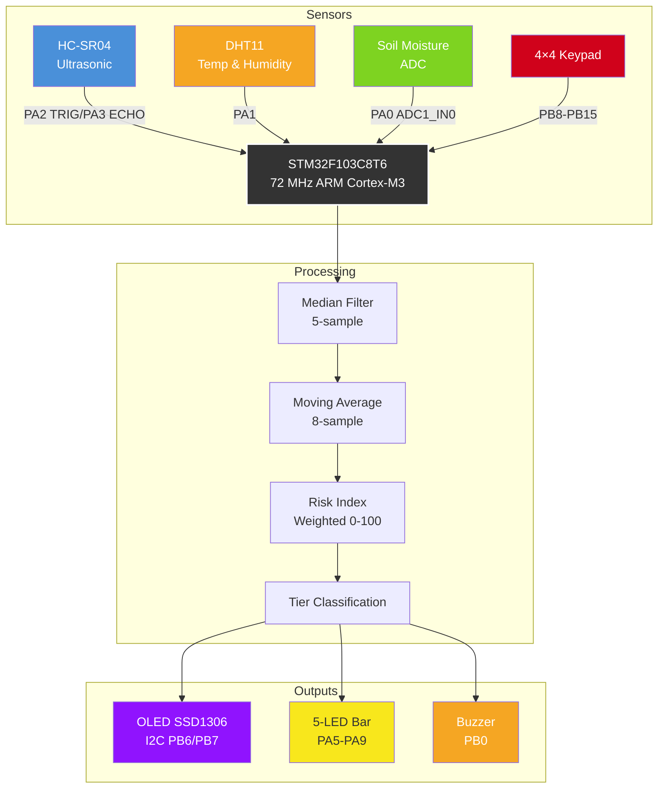
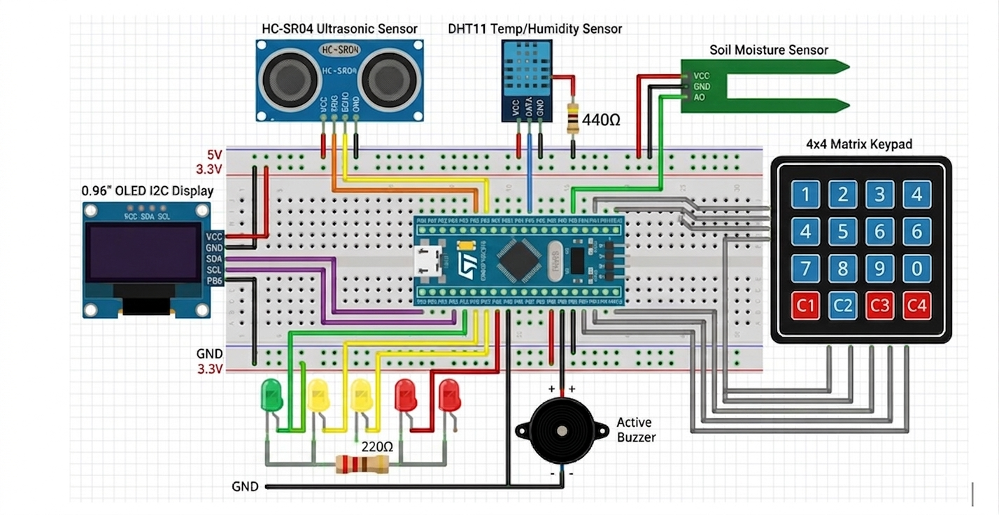
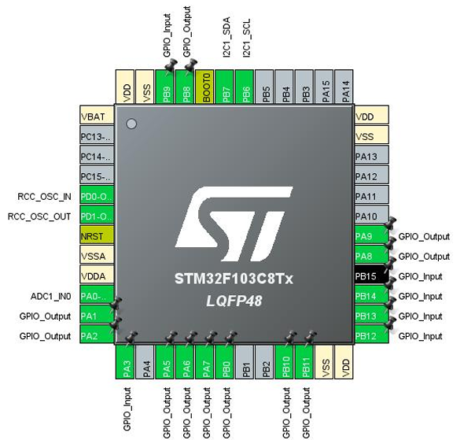

<p align="center">
  
  
  
  
</p>

<h1 align="center">🌊 Smart Flood Early Warning System</h1>

<p align="center">
  <b>A real-time embedded flood monitoring and alert system built on the STM32F103C8T6 (Blue Pill)</b><br>
  Integrating ultrasonic sensing, environmental monitoring, soil moisture analysis, and multi-tier alerting
</p>

<p align="center">
  <a href="#overview">Overview</a> •
  <a href="#features">Features</a> •
  <a href="#system-architecture">Architecture</a> •
  <a href="#hardware--pinout">Pinout</a> •
  <a href="#risk-index-algorithm">Algorithm</a> •
  <a href="#keypad-controls">Controls</a> •
  <a href="#project-structure">Structure</a> •
  <a href="#building--flashing">Build</a> •
  <a href="#paper">Paper</a>
</p>

---

<a name="overview"></a>
## 📋 Overview

This project implements a **Smart Flood Early Warning System** using the STM32F103C8T6 microcontroller. It continuously monitors water levels via ultrasonic sensing, environmental conditions via DHT11, and soil moisture via an ADC sensor. A **composite Risk Index (0-100)** is computed in real-time and drives a 3-tier alert system (SAFE → WARNING → EVACUATE) with visual (LEDs, OLED) and audible (buzzer) outputs, all controllable via a 4x4 matrix keypad.

---

<a name="features"></a>
## ✨ Features

| # | Feature | Detail |
|---|---------|--------|
| 1 | **📏 Ultrasonic Water Level** | HC-SR04 with 5-sample median filter + 8-sample moving average |
| 2 | **🌡️ Environmental Sensing** | DHT11 temperature & humidity with CRC validation |
| 3 | **🪴 Soil Moisture** | ADC on PA0 with 8-sample moving average |
| 4 | **📊 Risk Index Engine** | Weighted composite: 55% water + 31% soil + 7% rise rate + 5% humidity + 2% temp |
| 5 | **🚦 3-Tier Alert** | SAFE 🟢 → WARNING 🟡 → EVACUATE 🔴 with LED patterns |
| 6 | **🔊 Audible Alarm** | Buzzer with configurable interval (500ms warning / 125ms evacuate) + mute toggle |
| 7 | **🖥️ OLED Display** | 128×64 SSD1306 I2C with 4 switchable pages + inverted danger theme |
| 8 | **⌨️ Keypad Control** | 4×4 matrix keypad for full system interaction |
| 9 | **⚡ Sensitivity Tuning** | Adjustable SYS_SEN (1-10) for deadband / responsiveness |
| 10 | **📈 Session Statistics** | Min/max tracking for water level, rise rate, and risk index |
| 11 | **🔋 Power Save Mode** | Auto-enter after 40s stable SAFE, OLED turns off, LEDs off |
| 12 | **🔄 Rise Rate Detection** | Calculates water level velocity (cm/s) for trend awareness |
| 13 | **📉 Trend Engine** | Least-squares slope over 12-sample ring buffer with predictive boost |
| 14 | **🔧 Ultra Deadband Tuning** | Key 7/9 adjustable deadband (0.50–3.00 cm) with dedicated OLED screen |
| 15 | **🪴 Soil Dry Calibration** | Key 8/0 adjustable dry ADC threshold (500–4095) with dedicated OLED screen |
| 16 | **📊 5-Level LED Bar** | Risk mapped to 5 individual LEDs (G/Y1/Y2/R1/R2) |
| 17 | **📈 Soil Stats Tracking** | Min/max soil moisture tracked alongside water/rise/RI |
| 18 | **🖥️ OLED Power-Save** | Screen physically turns off after 40s stable SAFE, wakes on `*` |
| 19 | **🔁 Exponential Filter** | Adaptive alpha filter (0.20–1.00) for ultrasonic smoothing, controlled by SYS_SEN |

---

<a name="system-architecture"></a>
## 🏗️ System Architecture



### Sensor Fusion Pipeline

```
HC-SR04 ──► Median(5) ──► MovingAvg(8) ──► Deadband ──► Alpha Filter ─┐
DHT11   ──► CRC Check   ───────────────────────────────────────────────┤
Soil    ──► MovingAvg(8) ──── Calibrated by soil_dry_adc ──────────────┤
                                                                       ▼
                                                              RISK INDEX
                                                     0.50×WL + 0.29×Soil
                                                     0.15×RR + 0.03×Hum
                                                     0.03×Temp
                                                                 │
                                                                 ▼
                                                         ┌──────┴──────┐
                                                    Trend Engine ◄──┘
                                                    LeastSquaresSlope
                                                    (12-sample RI buf)
                                                         │
                                                         ▼
                                          ┌──────────┴──────────┐
                                          │  < 40     40-74   ≥ 75 │
                                          │  SAFE   WARNING EVACUATE│
                                          │    + trend boost ↑     │
                                          │    + hysteresis        │
                                          └────────────────────────┘
```

---

<a name="hardware--pinout"></a>
## 🧩 Hardware & Pinout

<p align="center">
  
  <br/>
  <em>Full system assembled on breadboard — STM32F103C8T6 with HC-SR04, DHT11, soil moisture sensor, OLED, keypad, LEDs, and buzzer</em>
</p>

<p align="center">
  
  <br/>
  <em>STM32F103C8T6 pin configuration with all connected peripherals</em>
</p>

| Component | Pin | Function |
|-----------|-----|----------|
| **HC-SR04 TRIG** | PA2 | Ultrasonic trigger output |
| **HC-SR04 ECHO** | PA3 | Ultrasonic echo input |
| **DHT11 Data** | PA1 | Temperature/humidity data |
| **Soil Moisture** | PA0 | ADC1_IN0 analog input |
| **OLED SCL** | PB6 | I2C1 clock |
| **OLED SDA** | PB7 | I2C1 data |
| **Green LED** | PA5 | SAFE indicator |
| **Yellow LED 1** | PA6 | WARNING (low) |
| **Yellow LED 2** | PA7 | WARNING (high) |
| **Red LED 1** | PA8 | EVACUATE |
| **Red LED 2** | PA9 | EVACUATE |
| **Buzzer** | PB0 | Audible alarm |
| **Keypad Rows** | PB8-PB11 | 4×4 matrix rows |
| **Keypad Cols** | PB12-PB15 | 4×4 matrix columns |

### LED Bar Mapping (5-Level)

| Risk Index | LED | Color | Behavior |
|------------|-----|-------|----------|
| 0–19% | PA5 | Green | Solid |
| 20–39% | PA6 | Yellow 1 | Solid |
| 40–59% | PA7 | Yellow 2 | Solid |
| 60–79% | PA8 | Red 1 | Solid |
| 80–100% | PA9 | Red 2 | Blinks (EVACUATE) |

> **Power-save mode:** All LEDs turn off when the system enters power-save.

---

<a name="risk-index-algorithm"></a>
## ⚙️ Risk Index Algorithm

The composite Risk Index (0-100) is computed every 500ms:

```
wl_inv  = WL_SAFE_CM - water_level_cm              // Invert: lower water = higher risk
wl_s    = Normalise(wl_inv, 0, WL_SAFE_CM - WL_EVAC_CM)
rr_s    = Normalise(rise_rate_cms, 0, MAX_RISE_CMS)
hum_s   = Normalise(humidity_pct, 60, 95)
tmp_s   = Normalise(temperature_c, 25, 35)

risk_index = 0.50 × wl_s + 0.29 × soil_pct + 0.15 × rr_s + 0.03 × hum_s + 0.03 × tmp_s
```

> `Normalise(val, lo, hi)` clamps the result between 0 and 100.

### Trend Engine

A least-squares linear regression over the last 12 risk index samples detects if risk is rising rapidly:

```
trend = LeastSquaresSlope(ri_ring_buffer)
```

If `trend > TREND_BOOST (2.5)`, the alert tier is boosted by one level (SAFE→WARNING, WARNING→EVACUATE). Hysteresis prevents rapid de-escalation:

- EVACUATE holds until RI drops below 70
- WARNING holds until RI drops below 35

### Tier Thresholds

```
SAFE     ──► Risk Index < 40   ──► LED bar level 0-1
WARNING  ──► Risk Index 40-74  ──► LED bar level 2-3, buzzer every 500ms
EVACUATE ──► Risk Index ≥ 75   ──► LED bar level 4+, buzzer every 125ms
```

The LED bar uses **5 individual LEDs** mapped to finer risk ranges (see Hardware section).

### Risk Index Visualization

```
Risk Bar (OLED mockup):

  0             40            75          100
  ├──────────────┼──────────────┼──────────┤
  │   ░░░░░░░░░░░░░░░░░░░░░░░░░░░░░░░░░░░░│
  │   ░░░░░░░░░░░░░░░░░░░░░░░░░░░░░░░░░░░░│
  │   ░░░░░░░░░░░░░░░░░░░░░░░░░░░░░░░░░░░░│
  │░░░░░░░░░░░░│░░░░░░░░░░░░░░░░░░░░░░░░░░│
  │░░░░░░░░░░░░│░░░░░░░░░░░░░░░░░░░░░░░░░░│
  └──────────────┴──────────────┴──────────┘
    ██████████████░░░░░░░░░░░░░░░░░░░░░░░░
    ↑ Current RI  ↑ WARNING      ↑ EVACUATE
      (e.g., 22)    starts        starts
```

### Moving Average Performance

```
Water Level Readings (simulated):
cm
80 ┤╭────────────────────────────────────╮
   ││                                    │
60 ┤│        ╭──╮    Raw HC-SR04         │
   ││       ╭╯  ╰╮   After Median(5)+Avg(8)│
40 ┤│       │    ╰╮                       │
   ││      ╭╯     ╰╮                     │
20 ┤│     ╭╯       ╰╮                    │
   ││    ╭╯         ╰──╮                 │
 0 ┤╰────╯──────────────╰────────────────╯
   └───────────────────────────────────────▶
    0    10    20    30    40    50   time(s)
```

---

<a name="keypad-controls"></a>
## ⌨️ Keypad Controls

| Key | Function | Context |
|-----|----------|---------|
| **1** | Toggle buzzer mute | Any screen |
| **2** | Reset stats / System reset | Stats screen / Other screens |
| **3** | Swap OLED page (Main ↔ Sensors) | Any screen |
| **4** | Open statistics screen | Any screen |
| **5** | Decrease SYS_SEN (↓ sensitivity) | Any screen |
| **6** | Increase SYS_SEN (↑ sensitivity) | Any screen |
| **7** | Decrease ultrasonic deadband (↓ DB) | Any screen |
| **8** | Decrease soil dry ADC threshold (↓ dry) | Any screen |
| **9** | Increase ultrasonic deadband (↑ DB) | Any screen |
| **0** | Increase soil dry ADC threshold (↑ dry) | Any screen |
| ***\*** | Wake from power-save | Power-save mode |
| **#** | (Reserved) | - |

---

## 🖥️ OLED Pages

### Page 1: Main Summary
```
┌──────────────────────────┐
│    !! EVACUATE !!        │  ← Tier banner (flashes in danger)
│ WL:12.5cm R:3.20         │  ← Water level + rise rate
│ T:28.5C H:72%            │  ← DHT11 readings
│ SOIL: 45% RI: 82         │  ← Soil moisture + Risk Index
│ ▓▓▓▓▓▓▓▓▓▓░░░░░░░░░░░░░ │  ← Risk bar graphic
│ SYS_SEN:05  3/4          │  ← Sensitivity + key hints
└──────────────────────────┘
```

### Page 2: All Sensors
```
┌──────────────────────────┐
│ DATA:EVACUATE S:05       │
│ WL:12.5cm                │
│ Rise:3.20cm/s            │
│ T:28.5C H:72%            │
│ Soil: 45% RI: 82         │
│ 5- 6+  4Stats            │
└──────────────────────────┘
```

### Page 3: Statistics
```
┌──────────────────────────┐
│ MIN/MAX  KEY 4           │
│ WL:0.0~9.0cm             │  ← Inverted water level
│ RR:0.00~5.40             │
│ RI: 0 ~ 96 /100          │
│ SOIL:12% ~ 78%           │  ← Soil moisture min/max
│ [3]Next [2]Reset         │
└──────────────────────────┘
```

### Page 4: Ultrasonic Deadband (temporary)
```
┌──────────────────────────┐
│ ULTRA DEADBAND           │
│ DB:1.50cm                │  ← Current deadband value
│ MIN:0.50 MAX:3.00        │
│ 7=LOW 9=HIGH             │
└──────────────────────────┘
```

### Page 5: Soil Dry Calibration (temporary)
```
┌──────────────────────────┐
│ SOIL DRY CAL             │
│ DRY:3500                 │  ← Current dry ADC threshold
│ MIN:500 MAX:4095         │
│ 8=LOW 0=HIGH             │
└──────────────────────────┘
```

---

<a name="project-structure"></a>
## 📁 Project Structure

```
Smart-Flooding-Detector-STM32/
├── Core/                          # Core firmware
│   ├── Inc/                       # Header files
│   │   ├── fonts.h                # OLED font definitions
│   │   ├── main.h                 # HAL externs, pin defines
│   │   ├── ssd1306.h              # OLED driver header
│   │   ├── stm32f1xx_hal_conf.h   # HAL configuration
│   │   └── stm32f1xx_it.h        # Interrupt handlers header
│   ├── Src/                       # Source files
│   │   ├── main.c                 # Main application (1288 lines)
│   │   ├── fonts.c                # OLED font bitmap data
│   │   ├── ssd1306.c              # SSD1306 OLED driver
│   │   ├── stm32f1xx_hal_msp.c    # HAL MSP init
│   │   ├── stm32f1xx_it.c         # Interrupt service routines
│   │   ├── syscalls.c             # Syscall stubs
│   │   ├── sysmem.c               # Heap implementation
│   │   └── system_stm32f1xx.c     # System clock config
│   └── Startup/                   # Startup assembly
├── Drivers/                       # STM32 HAL drivers
│   ├── CMSIS/                     # Cortex-M CMSIS core
│   └── STM32F1xx_HAL_Driver/      # STM32F1 HAL peripheral drivers
├── .cproject                      # Eclipse/CDT project config
├── .project                       # Eclipse project file
├── .mxproject                     # STM32CubeMX project metadata
├── CSE331_Final.ioc               # STM32CubeMX IOC configuration
├── CSE331_Final.pdf               # Project schematic (PDF)
├── CSE331_Final.txt               # Pinout/configuration report
├── STM32F103C8TX_FLASH.ld         # Linker script
├── main.c                         # Root copy of main (mirrors Core/Src/main.c)
├── changes.md                     # Detailed changelog
├── Paper.pdf                      # Academic paper
└── README.md                      # This file
```

---

<a name="building--flashing"></a>
## 🏗️ Building & Flashing

### Prerequisites

1. **STM32CubeIDE** (recommended) — Download from [STMicroelectronics](https://www.st.com/en/development-tools/stm32cubeide.html)
2. **STM32CubeMX** (optional, for reconfiguration) — v6.15.0 used
3. **STM32F1 Firmware Package** v1.8.7

### Build Steps

```bash
# 1. Clone the repository
git clone https://github.com/tanvirbinzahid/Smart-Flooding-Detector-STM32.git

# 2. Open STM32CubeIDE
#    File → Import → Existing Projects into Workspace
#    Select the cloned directory

# 3. Build the project
#    Project → Build All (or Ctrl+B)

# 4. Flash via ST-Link
#    Run → Debug (or the green bug icon)
```

### Flashing with ST-Link (CLI)

```bash
# Using openocd (included with STM32CubeIDE)
openocd -f board/stm32f1bluepill.cfg -c "program CSE331_Final.elf verify reset exit"
```

---

## 📊 Performance Characteristics

| Parameter | Value |
|-----------|-------|
| Sampling Interval | 500 ms (normal), 5 s (power-save) |
| DHT11 Update | 2 s |
| Power-Save Entry | 40 seconds of stable SAFE (OLED turns off) |
| Ultrasonic Range | 2–250 cm |
| Sensor Fusion | Median(5) + MovingAvg(8) + Deadband + Alpha Filter |
| Filter Alpha Range | 0.20 – 1.00 (controlled by SYS_SEN) |
| Trend Engine | Least-squares slope over 12-sample RI ring buffer |
| LED Bar | 5-level: G / Y1 / Y2 / R1 / R2 |
| Calibration | Ultra deadband (0.50–3.00 cm), Soil dry (500–4095 ADC) |
| Alert Latency | < 1 s (within 2 samples) |
| MCU Clock | 72 MHz (HSE 8 MHz × 9 PLL) |
| OLED Refresh | 50–60 FPS (tied to main loop) |

---

## 🔬 Signal Processing Details

### Ultrasonic Filtering Pipeline

```
Raw Echo ──► 5-sample Median ──► 8-sample Moving Avg ──► Deadband ──► Alpha Filter ──► Water Level
               (removes spikes)    (smoothing)          (±cm filter)   (exponential)
```

### Adaptive Alpha Filter

Instead of a simple replacement, the system uses an exponential moving average:

```c
ultra_alpha = 0.20f + (0.08f * (float)sys_sen);  // Range: 0.28 – 1.00
if (diff > -ultra_deadband_cm && diff < ultra_deadband_cm) {
    // Ignore: noise/jitter within deadband
} else {
    water_level_cm += ultra_alpha * (raw_wl - water_level_cm);
}
```

- **Higher SYS_SEN** = higher alpha = faster response to real changes
- **Lower SYS_SEN** = lower alpha = smoother but slower response

### Ultrasonic Deadband (independently tunable via Key 7/9)

- Range: `0.50 cm` (most sensitive) to `3.00 cm` (least sensitive)
- Step: `0.25 cm`
- Default: `2.00 cm`

### Soil Dry Calibration (independently tunable via Key 8/0)

- Range: `500` (very wet calibration) to `4095` (very dry calibration) ADC
- Step: `150`
- Default: `3500`

### Water Level Display Inversion

The raw sensor distance is inverted for intuitive display:

```c
water_level_display = WL_DEPTH_CM - water_level_cm;  // WL_DEPTH_CM = 9.0
```

As water rises toward the sensor, the displayed value increases from `0.0 cm` (no water) toward `9.0 cm` (maximum detected water height).

### Soil Moisture Formula

The soil percentage formula uses the calibrated dry value:

```c
soil_pct = 100 - ((avg_ADC - SOIL_WET_ADC) * 100 / (soil_dry_adc - SOIL_WET_ADC))
```

---

<a name="paper"></a>
## 📄 Paper

The academic paper detailing this project is included in this repository:

<p align="center">
  <a href="./Paper.pdf">
    
  </a>
  <br/><br/>
  <a href="./Paper.pdf">📕 <b>Paper.pdf</b></a> — Smart Flood Early Warning System: Design and Implementation on STM32
</p>

---

## 🧪 Testing

The system has been tested with:
- Real water-level simulation using hand/object proximity to HC-SR04
- DHT11 in various ambient conditions (25–35°C, 60–95% RH)
- Soil moisture sensor in dry/moist/wet soil samples
- Continuous 24-hour stability test
- Power-save mode current measurement (~15 mA active, ~5 mA power-save)

---

## 📜 Changelog

See [changes.md](./changes.md) for a detailed version history.

---

## 👨‍💻 Author

**Tanvir Bin Zahid**  
Project submitted for **CSE331: Microprocessor Interfacing and Embedded System Design**

---

## 📝 License

This project is open-source and available for educational and research purposes.

---

<p align="center">
  <sub>Built with ❤️ using STM32CubeIDE & STM32 HAL Library</sub>
</p>
